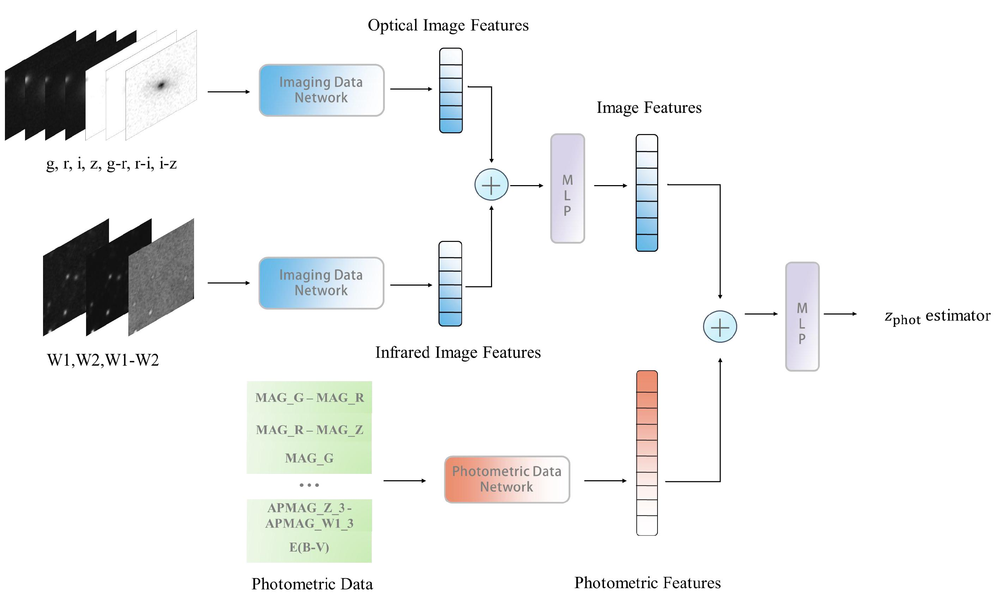

# Photometric redshift estimation for emission line galaxies of DESI Legacy Imaging Surveys by CNN-MLP

Code for Wei et al. *"Photometric redshift estimation for emission line galaxies of DESI Legacy Imaging Surveys by CNN-MLP."* [arXiv:2505.24175 (2025)](https://arxiv.org/abs/2505.24175).


---
## Repo Description

！Dataset is not here due to the size limit.


```
zphot_ELG
├── config: yaml file for configuration
│   └── config_split.yaml: configuration for pre-split dataset: training, validation and test. 
├── data: code for loading dataset
│   ├── __init__.py
│   ├── dataset_split.py: pre-split dataset to training, validation and testing
│   ├── dataset.py: custom dataset and dataloader initialization
│   ├── filter.py: filter function for dataset filtering
│   ├── load_utils.py: utils used in loading function.
│   ├── mag_compute.py: compute magnitude distribution of dataset.
│   └── z_compute.py: compute z bins for redshift classification
├── models: model.
│   ├── model.py: multimodal model for redshift estimation
├── analysis.py: figure in anlysis
├── metrics.py: metrics computation.
├── requirements.txt
├── train.py: train and validation function.
├── utils.py: utils in training process.
└── visual.py: visualize training loss.
```

## Quick Start
### Environment
```
git clone 
conda create -n Zphot4ELG
conda activate Zphot4ELG
cd Zphot_ELG/
pip install -r requirements.txt
mkdir output
mkdir weights
```
### Train & Test
- prepare your dataset, prefer pre-select dataset. Use data/dataset_split.py to split. Dataset should include images,catalog data and redshift values.
- modify config/config_split.yaml to adapt to your own dataset.
- if you have W&B account, login and create a project for it.
- execute this command: ```nohup python3 -u train.py > logs/log.txt 2>&1 &```

and go to logs/log.txt to check log and go to weights/ to check model's weights.


## Citation
```
@ARTICLE{2025arXiv250524175W,
       author = {{Wei}, Shirui and {Li}, Changhua and {Zhang}, Yanxia and {Cui}, Chenzhou and {Tang}, Chao and {Zhang}, Jingyi and {Zhao}, Yongheng and {Wu}, Xuebing and {Tao}, Yihan and {Fan}, Dongwei and {Li}, Shanshan and {Xu}, Yunfei and {Huang}, Maoyuan and {Yang}, Xingyu and {Kang}, Zihan and {Shi}, Jinghang},
        title = "{Photometric redshift estimation for emission line galaxies of DESI Legacy Imaging Surveys by CNN-MLP}",
      journal = {arXiv e-prints},
     keywords = {Instrumentation and Methods for Astrophysics, Astrophysics of Galaxies},
         year = 2025,
        month = may,
          eid = {arXiv:2505.24175},
        pages = {arXiv:2505.24175},
          doi = {10.48550/arXiv.2505.24175},
archivePrefix = {arXiv},
       eprint = {2505.24175},
 primaryClass = {astro-ph.IM},
       adsurl = {https://ui.adsabs.harvard.edu/abs/2025arXiv250524175W},
      adsnote = {Provided by the SAO/NASA Astrophysics Data System}
}

```

## Acknowledgement
- Pasquet et al. 2019: [https://github.com/jpasquet/photoz](https://github.com/jpasquet/photoz)


